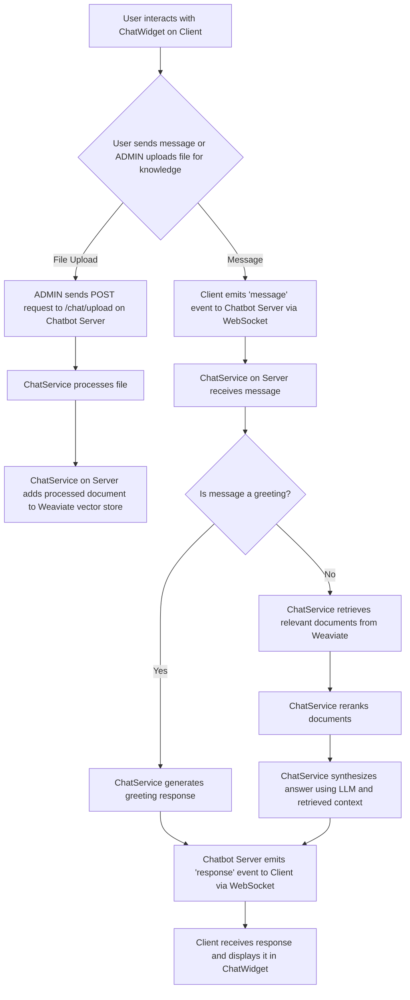

# Bab 4.1 Design

This chapter describes the design of the chatbot project, encompassing both the backend `chatbot-server` and the frontend `Client` application. The project is designed as a client-server architecture, where the frontend handles user interaction and displays information, while the backend processes natural language, manages knowledge bases, and generates responses.

## 4.1.1 Overall Architecture

The system follows a clear separation of concerns:

*   **Client Application (Frontend):** A Next.js application responsible for the user interface, displaying the chat widget, sending user messages, and receiving bot responses. It also handles file uploads to the backend.
*   **Chatbot Server (Backend):** A NestJS application that acts as the brain of the chatbot. It integrates with various AI models (Ollama for LLM and embeddings, Moondream for image analysis), a vector database (Weaviate) for knowledge retrieval, and a reranking service to improve response relevance.

The communication between the Client and the Chatbot Server is primarily via WebSockets for real-time chat messages and HTTP for file uploads.

### High-Level Flowchart of Chat Interaction



## 4.1.2 Chatbot Server Design

The `chatbot-server` is built using NestJS and leverages several key technologies for its functionality:

### Key Components:

*   **`ChatService` (`src/chat/chat.service.ts`):** This is the core service that orchestrates the chatbot's logic.
    *   **LangChain Integration:** Utilizes LangChain for building the RAG (Retrieval Augmented Generation) pipeline.
    *   **Ollama:** Used for both the Large Language Model (LLM, `llama3`) for generating responses and for embeddings (`mxbai-embed-large`) to convert text into vector representations for similarity search. Moondream is used for vision capabilities to process images.
    *   **Weaviate:** A vector database used to store and retrieve documents. It acts as the knowledge base for the chatbot. Documents (text and image descriptions) are chunked and embedded before being stored in Weaviate.
    *   **MultiQueryRetriever:** Generates multiple versions of a user's query to improve document retrieval from the vector store.
    *   **History-Aware Retriever:** Considers the chat history to generate more relevant search queries.
    *   **Reranking Service:** An external service (accessed via `http://localhost:8082/rerank`) that re-orders retrieved documents based on their relevance to the user's query, ensuring the most pertinent information is used for synthesis.
    *   **Document Processing:** Handles both text and image files. For images, it uses the `moondream` vision model to extract structured information, which is then used as `pageContent` for document creation.
    *   **Chat History Management:** Stores chat histories per session to maintain context during conversations.
*   **`ChatGateway` (`src/chat/chat.gateway.ts`):** (Inferred, not explicitly read but standard for NestJS WebSocket) Handles WebSocket connections and events, allowing real-time communication between the client and the server for chat messages.
*   **`ChatController` (`src/chat/chat.controller.ts`):** (Inferred, not explicitly read but standard for NestJS HTTP) Handles HTTP requests, specifically for file uploads (`/chat/upload`).

### Data Flow (Chatbot Server):

1.  **Initialization (`onModuleInit`):**
    *   Initializes Ollama embeddings and vision models.
    *   Connects to the local Weaviate instance.
    *   Initializes the `WeaviateStore` with the `Chatbot` index.
    *   Sets up the `masterChain` (RAG pipeline).
2.  **File Processing (`processFile`, `processBatch`):
    *   When a file is uploaded, it's either treated as a text document or an image.
    *   If an image, `moondream` analyzes it to extract structured information (property name, pricing, etc.).
    *   The content (raw text or image description) is chunked using `RecursiveCharacterTextSplitter`.
    *   These chunks are then embedded using `OllamaEmbeddings` and added to the `WeaviateStore`.
    *   The `masterChain` is re-initialized, and all chat histories are cleared to reflect the updated knowledge base.
3.  **Answering Questions (`ask`):**
    *   Receives a user message and session ID.
    *   Checks if the message is a greeting; if so, provides a standard greeting.
    *   If not a greeting, the `masterChain` is invoked:
        *   `historyAwareRetrieverChain` generates a search query based on current input and chat history.
        *   `MultiQueryRetriever` generates multiple perspectives of the query.
        *   Documents are retrieved from Weaviate.
        *   Documents are filtered to include only text documents and image descriptions.
        *   `rerankInChunks` re-ranks the retrieved documents based on relevance to the query.
        *   `createStuffDocumentsChain` combines the top-ranked documents with the prompt and chat history to synthesize a final answer using the `llama3` LLM.
    *   The generated answer is sent back to the client, and the chat history for the session is updated.

## 4.1.3 Client Application Design

The `Client` application is a Next.js project, focusing on a responsive and interactive user experience.

### Key Components:

*   **`ChatWidget` (`src/modules/chatbot/components/Chat.tsx`):** This is the main React component for the chatbot interface.
    *   **State Management:** Uses React's `useState` hook to manage messages, input value, uploaded files, and UI states (e.g., `isOpen`, `showFileManager`, `isTyping`).
    *   **WebSocket Communication:** Uses `socket.io-client` to establish a WebSocket connection with the `chatbot-server` for real-time message exchange.
    *   **Message Display:** Renders user and bot messages, including a typing indicator for bot responses.
    *   **File Upload Interface:** Provides functionality to select and upload multiple files (images or text documents) to the backend via HTTP POST requests. It includes a file manager modal to display and manage selected files before submission.
    *   **Styling:** Uses CSS Modules (`chat.module.scss`) for scoped styling of the chat widget.
    *   **SVG Icons:** Custom SVG icons are rendered directly within the component for various UI elements (send, attach file, minimize, etc.).

### User Interaction Flow (Client):

1.  **Widget Toggle:** The user can open and close the chat widget.
2.  **Sending Messages:**
    *   User types a message into the input field.
    *   Pressing Enter or clicking the Send button triggers `handleSendMessage`.
    *   The message is added to the local state and emitted to the server via WebSocket (`socket.emit('message', inputValue)`).
    *   A typing indicator is shown while waiting for the bot's response.
3.  **Receiving Responses:**
    *   The client listens for `response` events from the server.
    *   Upon receiving a response, it's added to the local message state, and the typing indicator is hidden.
4.  **File Upload:**
    *   User clicks the "Add Files" button, opening a file input dialog.
    *   Selected files are added to a temporary `files` state and displayed in the file manager modal.
    *   User can remove files from the list.
    *   Clicking "Submit Files" sends each file as a `FormData` object to the `http://localhost:4500/chat/upload` endpoint.
    *   Upon successful upload, the file list is cleared, and the file manager closes.

## 4.1.4 Data Models (Inferred)

### Message (Client-side)

```typescript
interface Message {
  id: string;
  text: string;
  sender: 'user' | 'bot';
  timestamp: Date;
  type: 'text' | 'file';
  fileName?: string; // For file messages
}
```

### FileItem (Client-side)

```typescript
interface FileItem {
  id: string;
  file: File; // Actual File object
  name: string;
  size: number;
  type: string;
  uploadDate: Date;
}
```

### Document (LangChain/Weaviate)

```typescript
type Document = {
  pageContent: string;
  metadata: {
    source: 'text_document' | 'image_description' | string;
    file_name?: string;
    // Other metadata from original document
  };
};
```

## 4.1.5 Conclusion

The chatbot project is designed as a robust, scalable, and intelligent system capable of understanding user queries, processing various data types (text and images), and providing relevant responses based on a dynamic knowledge base. The clear separation between the client and server, coupled with the use of modern AI and data management technologies, ensures a flexible and maintainable architecture.

## 4.1.6 Project Roadmap (3-Month Estimate)

This roadmap outlines the estimated timeline for the development and implementation of the chatbot-server and client applications, assuming a 3-month project duration.

### Month 1: Planning & Core Backend Development

**Focus:** Establish foundational backend services, knowledge base, and core AI integration.

*   **Week 1-2: Setup & Initial Backend Services (Chatbot Server)**
    *   Project setup (NestJS, TypeScript).
    *   Docker/Docker Compose configuration for local development (Ollama, Weaviate).
    *   Basic `ChatService` structure (LangChain integration).
    *   Implement initial Ollama LLM and Embeddings setup.
    *   Weaviate integration for vector store.
    *   Basic text document processing and indexing.
    *   Unit tests for core `ChatService` functionalities.
*   **Week 3-4: RAG Pipeline & Reranking Integration (Chatbot Server)**
    *   Implement `MultiQueryRetriever` and `HistoryAwareRetriever`.
    *   Integrate external Reranking Service.
    *   Develop `processFile` logic for text documents (chunking, embedding, storing).
    *   WebSocket gateway setup (`ChatGateway`) for real-time communication.
    *   Initial API endpoint for file uploads (`ChatController`).
    *   Integration tests for the full RAG pipeline.

### Month 2: Advanced Backend & Frontend Integration

**Focus:** Enhance backend capabilities (vision, batch processing) and integrate the client application with the backend.

*   **Week 5-6: Vision & Batch Processing (Chatbot Server)**
    *   Integrate Moondream vision model for image analysis.
    *   Develop structured information extraction from images.
    *   Implement `processBatch` for efficient multiple file uploads.
    *   Refine document metadata handling for both text and images.
    *   Performance optimization for embedding and retrieval.
*   **Week 7-8: Client Application Development & Integration (Client)**
    *   Next.js project setup.
    *   Develop `ChatWidget` UI (message display, input field, send button).
    *   Implement WebSocket client (`socket.io-client`) for chat.
    *   Integrate file upload functionality in `ChatWidget` (UI for file selection, display, removal).
    *   Connect client file upload to backend `/chat/upload` endpoint.
    *   Basic styling and responsiveness.

### Month 3: Testing, Refinement & Deployment

**Focus:** Comprehensive testing, bug fixing, performance tuning, and preparing for deployment.

*   **Week 9-10: End-to-End Testing & Bug Fixing**
    *   Conduct extensive end-to-end testing for both chat interaction and file upload workflows.
    *   Identify and fix bugs in both client and server.
    *   User Acceptance Testing (UAT) with sample users.
    *   Refine chatbot responses and prompt engineering for better accuracy and relevance.
    *   Security review for file uploads and API endpoints.
*   **Week 11-12: Performance Optimization & Deployment Preparation**
    *   Optimize database queries and indexing in Weaviate.
    *   Monitor and improve LLM inference speed.
    *   Containerization optimization (Docker image size, build times).
    *   Documentation updates (API, deployment guide).
    *   Prepare deployment scripts and environment (e.g., Kubernetes, cloud services).
    *   Final review and handover.
